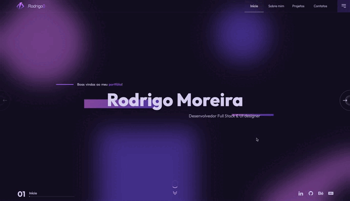

This is a [Next.js](https://nextjs.org) project bootstrapped with [`create-next-app`](https://nextjs.org/docs/app/api-reference/cli/create-next-app).

## Getting Started

First, run the development server:

```bash
npm run dev
# or
yarn dev
# or
pnpm dev
# or
bun dev
```

Open [http://localhost:3000](http://localhost:3000) with your browser to see the result.

You can start editing the page by modifying `app/page.tsx`. The page auto-updates as you edit the file.

This project uses [`next/font`](https://nextjs.org/docs/app/building-your-application/optimizing/fonts) to automatically optimize and load [Geist](https://vercel.com/font), a new font family for Vercel.

## Learn More

To learn more about Next.js, take a look at the following resources:

- [Next.js Documentation](https://nextjs.org/docs) - learn about Next.js features and API.
- [Learn Next.js](https://nextjs.org/learn) - an interactive Next.js tutorial.

You can check out [the Next.js GitHub repository](https://github.com/vercel/next.js) - your feedback and contributions are welcome!

## Deploy on Vercel

The easiest way to deploy your Next.js app is to use the [Vercel Platform](https://vercel.com/new?utm_medium=default-template&filter=next.js&utm_source=create-next-app&utm_campaign=create-next-app-readme) from the creators of Next.js.

Check out our [Next.js deployment documentation](https://nextjs.org/docs/app/building-your-application/deploying) for more details.

-------

<div align="center">
  
</div>

<h1 align="center">Rodrigo's Portfolio</h1>

## 👋🏽 Introduction

Welcome to my portfolio! I’m a full-stack software developer who uses programming to develop innovative solutions and attractive user interfaces. In this portfolio you’ll be able to see an overview of my work and some personal projects I’ve developed in order to improve my skills and expand my knowledges.

## 📚 Table of contents

- [👋🏽 Introduction](#-introduction)
- [📚 Table of contents](#-table-of-contents)
- [👨🏽‍💻 About me](#-about-me)
- [🛠 Technologies](#-technologies)
- [📺 How to view](#-how-to-view)
- [🚀 How to run](#-how-to-run)
- [🖼 Previews](#-previews)
- [👨🏽‍🦱 Author](#-author)

## 👨🏽‍💻 About me

As mentioned earlier, I’m a full-stack software developer with a strong emphasis on front-end web development. Although my specialisation lies in creating engaging user interfaces, I am equally adept at back-end development and creating mobile applications. My passion for technology is marked by a sincere appreciation for the world of UI/UX design, where I do some work using Figma.

## 🛠 Technologies

<div>
  
  
  
  
  
  
  
  
</div>

## 📺 How to view

In case you want to take a look at the application, you can access the project at the official link just by [clicking here](https://rm-portfoliof.netlify.app/).

## 🚀 How to run

To install the application, you first need to clone the project to your local device. To do this, simply run the following command in your terminal:

```
git clone https://github.com/rodrigsmor/my-portfolio.git
```

With the application cloned on your local device, go to the portfolio directory and with the package manager of your choice, run the command to install the project packages.

```
# go to the cloned project directory
cd my-portfolio

# install dependencies
npm install
```

Once the dependencies are effectively installed, you are now fully able to run the application, so just run the following command:

```
npm run dev
```

> 💭 DETAIL: The application will probably be running on `http://localhost:5173/`.

## 🖼 Previews



## 👨🏽‍🦱 Author


<p>Developed with love by <b size="48px">Rodrigo Moreira</b> 
 💜🚀</p>

---

<div>
  <a href="mailto:rodrigsmor.pf@gmail.com">
    
  </a>
  <a href="https://www.linkedin.com/in/psrodrigomoreira/">
    
  </a>
  <a href="https://www.behance.net/rodrigsmor">
    
  </a>
  <a href="https://dev.to/psrodrigs">
    
  </a>
</div>

